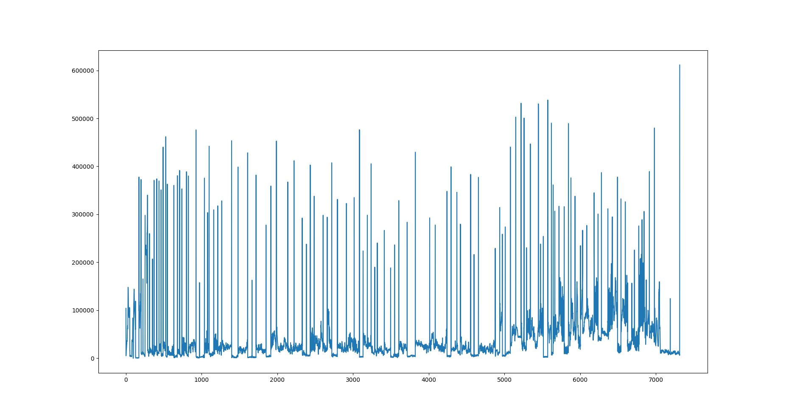

# cinembers
Generating numbers from movies, one movie at a time.

## Usage

As of now, `cinembers.py` script plots the differences between consecutive frames of a given video. Spikes in this plot indicate a possible change in shot.

The method used to _score_ the difference can be set by the `--score` flag. Available options are
- __SAD.__ Sum of Absolute Differences.
- __HD.__ Histogram Differences.
- __ECR.__ Edge Change Ratio.

More about these methods can be found [here](https://en.wikipedia.org/wiki/Shot_transition_detection#Methods).

```console
sumit@HAL9000:~/cinembers$ python3 cinembers.py -h
usage: cinembers.py [-h] -v VIDEO -s {SAD,HD,ECR}

Generating numbers from movies, one movie at a time.

optional arguments:
  -h, --help            show this help message and exit
  -v VIDEO, --video VIDEO
                        Filename of video.
  -s {SAD,HD,ECR}, --score {SAD,HD,ECR}
                        Scoring method.
```

## Example Usage

Plotting the _SAD_ between consecutive frames of this Britain's Got Talent [clip](https://www.youtube.com/watch?v=WSinMOs5eGw).

```console
sumit@HAL9000:~/cinembers$ python3 cinembers.py -v WSinMOs5eGw.mkv -s SAD
```


