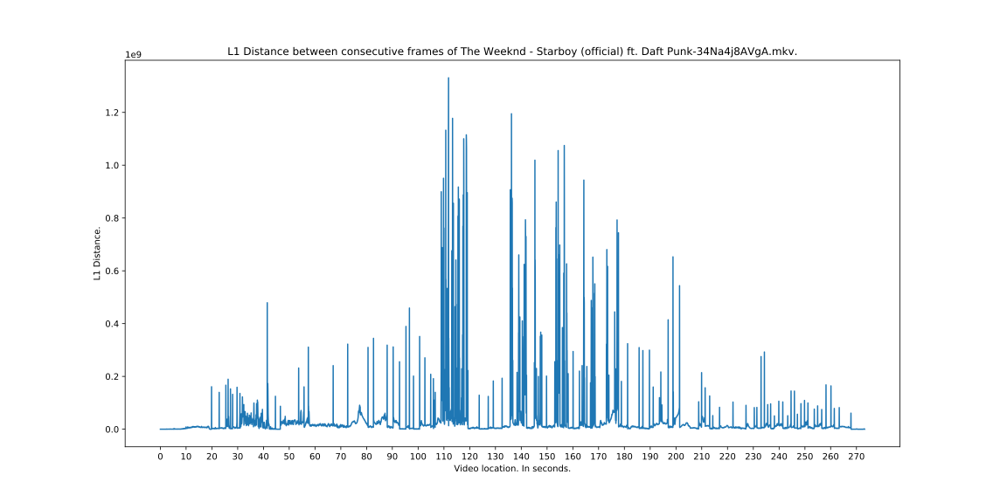

# cinembers
Generating numbers from movies, one movie at a time.

## Usage

As of now. The `cinembers.py` script plots the [_L1 distance_](https://en.wikipedia.org/wiki/Taxicab_geometry), also known as _Taxicab distance_ or _Manhattan distance_, between consecutive frames of a given video.

```console
sumit@HAL9000:~/cinembers$ python3 cinembers.py -h
usage: cinembers.py [-h] -v VIDEO

optional arguments:
  -h, --help            show this help message and exit
  -v VIDEO, --video VIDEO
                        Filename of video.
```

__Example Plot__ of music video of [Starboy by Weeknd](https://www.youtube.com/watch?v=34Na4j8AVgA).

